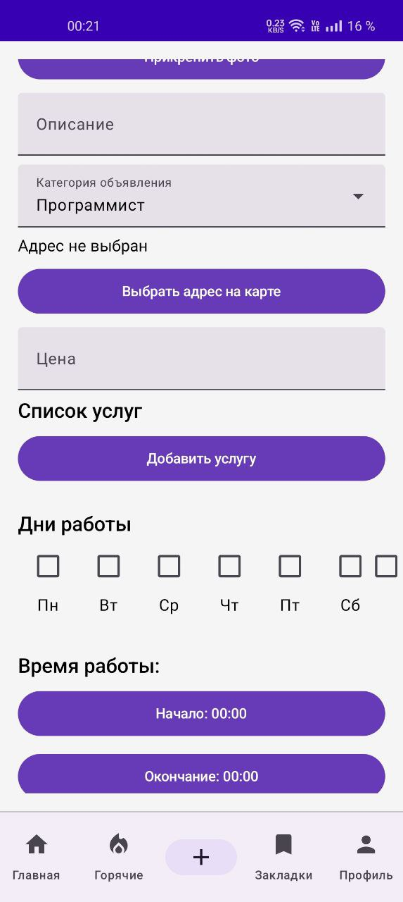
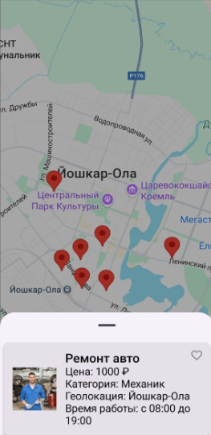
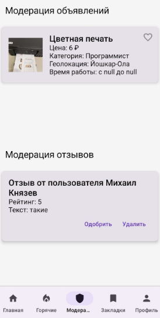

# Naymer

A modern Android classifieds application built with Kotlin and Jetpack Compose. This was my first project developed in Kotlin, showcasing the implementation of a full-featured mobile app with user authentication, real-time data management, and interactive maps.

## 📱 Overview

Naymer5 is a comprehensive classifieds platform that allows users to post, browse, and manage advertisements. The app features different types of ads (regular and "hot" ads), user profiles with reputation systems, moderation capabilities, and location-based services.

## ✨ Features

### Core Functionality
- **User Authentication**: Multi-provider login (Supabase, VK ID, Google)
- **Ad Management**: Create, edit, and browse advertisements
- **Hot Ads**: Premium advertisement system with special visibility
- **Bookmarks**: Save favorite ads and categories
- **Search & Filters**: Advanced filtering by category, price, location, and more
- **Location Services**: Interactive maps for ad locations using Google Maps and osmdroid
- **Real-time Updates**: Live data synchronization via Supabase

### User Roles & Moderation
- **User Profiles**: Reputation system and user management
- **Moderator Role**: Content moderation and ad approval system
- **Reviews & Ratings**: User feedback system for ads

### UI/UX
- **Material Design 3**: Modern Android design system
- **Dark/Light Theme**: Adaptive theming
- **Responsive Layout**: Optimized for various screen sizes
- **Intuitive Navigation**: Bottom navigation with role-based access

## 🛠️ Technologies Used

- **Language**: Kotlin
- **UI Framework**: Jetpack Compose
- **Architecture**: MVVM with Compose
- **Backend**: Supabase (PostgreSQL, Auth, Storage, Realtime)
- **Authentication**: VK ID, Google Sign-In
- **Maps**: Google Maps API, osmdroid
- **Networking**: Ktor HTTP client
- **Serialization**: Kotlinx.serialization
- **Image Loading**: Coil
- **Build System**: Gradle with Kotlin DSL

## 📸 Screenshots

### Main Screen

The main browsing interface with list/map toggle and search functionality.

### Ad Creation

Intuitive form for creating new advertisements with location picker.

### Filters

Advanced filtering options for category, price range, and location.

### Hot Ads

Premium advertisement section with enhanced visibility.

### Map View

Interactive map for selecting ad locations and browsing nearby ads.

### Moderation

Content moderation interface for approved users.

### Ad Details

Detailed view of individual advertisements with contact options.

### Profile

User profile management with reputation and settings.

## 🏗️ Architecture

The app follows modern Android development practices:

- **Compose-based UI**: Declarative UI with state management
- **Navigation Component**: Single-activity architecture with Compose navigation
- **Repository Pattern**: Data layer abstraction
- **Dependency Injection**: Manual DI with service locators
- **Coroutines & Flow**: Asynchronous operations and reactive data streams

## 🚀 Getting Started

### Prerequisites
- Android Studio Arctic Fox or later
- JDK 11
- Android SDK API 24+

### Setup
1. Clone the repository
2. Open in Android Studio
3. Configure API keys in `local.properties`:
   ```
   GOOGLE_MAPS_API_KEY=your_google_maps_key
   SUPABASE_URL=your_supabase_url
   SUPABASE_ANON_KEY=your_supabase_anon_key
   ```
4. Configure VK and Google auth credentials in `build.gradle.kts`
5. Build and run on device/emulator

## 📚 Learning Outcomes

As my first Kotlin project, this application helped me master:

- **Kotlin Fundamentals**: Language features, null safety, data classes
- **Android Development**: Activity lifecycle, permissions, intents
- **Jetpack Compose**: Declarative UI, state management, theming
- **Modern Android Architecture**: MVVM, repository pattern, coroutines
- **Third-party Integrations**: Authentication, maps, backend services
- **Material Design**: UI/UX principles and implementation
- **Version Control**: Git workflow and best practices

## 🤝 Contributing

This is a portfolio project showcasing my learning journey. While not actively maintained, feel free to explore the codebase and provide feedback.

---

*Built with ❤️ using Kotlin and Jetpack Compose*